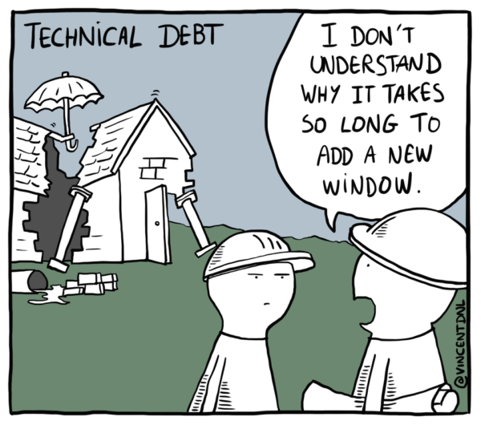

As software engineers we often balance trade-offs in our day to day jobs. One of the most common dilemmas is how to balance between delivery speed and delivery quality. This comes up in various forms, usually as a need for a urgent task that needs to be solve with a high priority.

Usually, projects or demands with defined time ranges for big deliveries and specific launch dates are passed down in a whole hierarchical chain of business experts, managers and product specialists, and for all of them, only speed matters. 

This throw us off, we tend to value more delivering to our customers in time than delivering better and robust later, we sabotage our own projects by rushing into solutions which generate big pile of tech debt. In this article we will debate about why you should oppose delivering any change which benefits delivery in favor of any code debt.

## Debs are Eternal

The follow up pull request does not exist. There is no such thing as TODOs or FIXMEs. The only  possible existing thing is the actual state of the code today.

We mislead ourselves thinking that one day all code will achieve the state that we have in our minds for it. We think that the prioritization for us to fix our tech debts will eventually come and then we make again, the same decisions that led us to the big ball of mud that our code is today.

 
<small>Image from: https://chrisfenning.com/the-seven-best-technical-debt-memes-to-make-you-laugh/ </small>

 

Although, tech debts are within a system itself, they scale much differently. A scalable code or system can handle sparse distribution of load and is able to retrieve itself to a working state. Technical debts scale on the thought of scaling a system. A quick fix that almost become permanent was only removed because it was preventing a new use case or a change in a existing one? Just at the thought of changing a system, tech debts arrives to remember you, that there is no free lunch.

This should be no more. We should be aware that any debt created in favor of any release is a  either a eternal debt or a impact on any subsequent change and release. We should attempt to get our systems to our highest standards.

## The importance of saying no as Software Engineer

> Slaves are not allowed to say no. Laborers may be hesitant to say no. But professionals are expected to say no. - Martin Fowler, "The Clean Coder"

We are expected to hold up to high standards every day, when you think about the value you add to a company you also need to factor in the value you add when saying no. This isn't a direct win and you will definitely find some friction, but it needs to be done.

